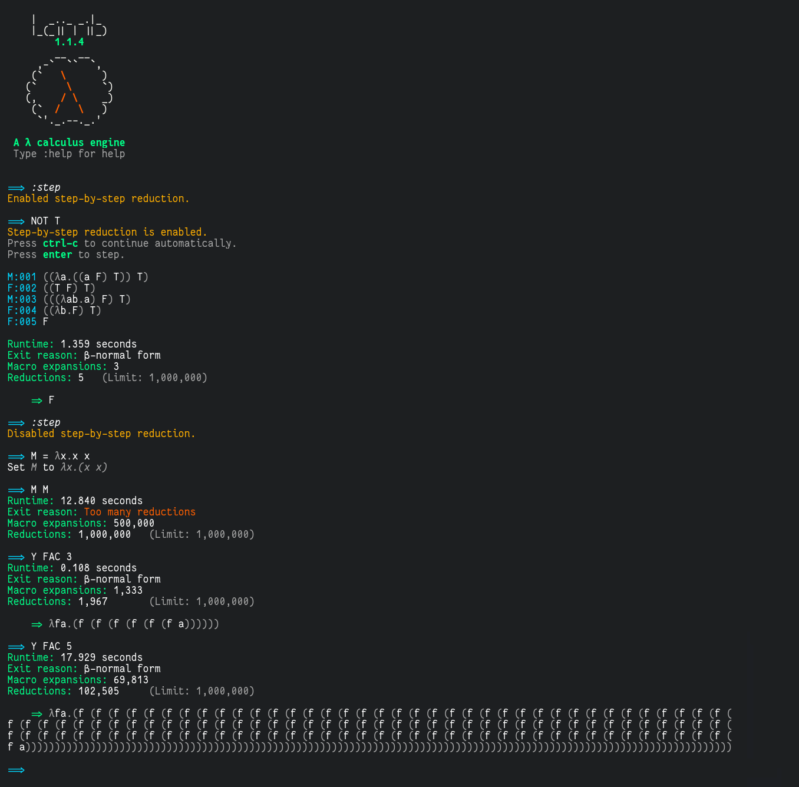

# Lamb: A Lambda Calculus Engine



## Installation

### Method 1: PyPi (not yet)
1. Put this on PyPi
2. Write these instructions

### Method 2: Git
1. Clone this repository.
2. Make and enter a [virtual environment](https://docs.python.org/3/library/venv.html).
3. ``cd`` into this directory
4. Run ``pip install .``
5. Run ``python .``

-------------------------------------------------

## Usage

Type lambda expressions into the prompt, and Lamb will evaluate them. \
Use your `\` (backslash) key to type a `λ`. \
To define macros, use `=`. For example,
```
~~> T = λab.a
~~> F = λab.a
~~> NOT = λa.a F T
```

Note that there are spaces in `λa.a F T`. With no spaces, `aFT` will be parsed as one variable. \
Lambda functions can only take single-letter, lowercase arguments. `λA.A` is not valid syntax. \
Unbound variables (upper and lower case) that aren't macros will become free variables. Free variables will be shown with a `'`, like `a'`.

Be careful, macros are case-sensitive. If you define a macro `MAC` and accidentally write `mac` in the prompt, `mac` will become a free variable.

Numbers will automatically be converted to Church numerals. For example, the following line will reduce to `T`.
```
~~> 3 NOT F
```

If an expression takes too long to evaluate, you may interrupt reduction with `Ctrl-C`.

-------------------------------------------------

## Commands

Lamb comes with a few commands. Prefix them with a `:`

`:help` Prints a help message

`:clear` Clear the screen

`:rlimit [int | None]` Set maximum reduction limit. `:rlimit none` sets no limit.

`:macros` List macros in the current environment.

`:mdel [macro]` Delete a macro

`:save [filename]`\
`:load [filename]` Save or load the current environment to a file. The lines in a file look exactly the same as regular entries in the prompt, but must only contain macro definitions.

-------------------------------------------------

## Internals

Lamb treats each λ expression as a binary tree. Variable binding and reduction are all simple operations on that tree. All this magic happens in [`nodes.py`](./lamb/nodes.py).

**Highlights:**
 - `TreeWalker` is the iterator we (usually) use to traverse our tree. It walks the "perimeter" of the tree, visiting some nodes multiple times.
 - `Node` is the base class for all nodes. Any node has `.left` and `.right` elements, which may be `None` (empty). `Node`s also reference their parent and their direction relative to their parent, to make tree traversal easy.
 - Before any reduction is done, variables are bound via `bind_variables`. This prevents accidental conflicts common in many lambda parsers.

-------------------------------------------------


## Todo (pre-release):
 - Make command output accessible in prompt
 - Prettier colors
 - Prevent macro-chaining recursion
 - step-by-step reduction
 - Full-reduce option (expand all macros)
 - PyPi package
 - Cleanup warnings
 - History queue
 - `W` isn't fully expanded. Why??


## Todo:
 - Better class mutation: when is a node no longer valid?
 - Loop detection
 - Command-line options (load a file, run a set of commands)
 - $\alpha$-equivalence check
 - Unchurch macro: make church numerals human-readable
 - Syntax highlighting: parenthesis, bound variables, macros, etc