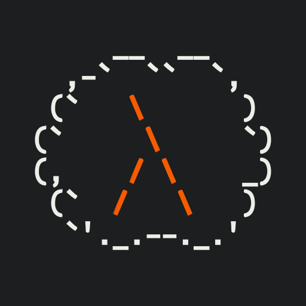

<h1 align="center">
 
Lamb: A Lambda Calculus Engine
</h1>

## Todo (pre-release):
 - Fix parser (call parentheses)
 - Good command parsing (`:help`, `:save`, `:load`, `:macros` as a bare minimum)
 - Python files: installable, package list, etc
 - $\alpha$-equivalence check
 - Don't expand macros until you absolutely have to
 - Versioning
 - Clean up runner & printing
 - Count reductions

## Todo:
 - live syntax check
 - Command and macro autocomplete
 - step-by-step reduction
 - Documentation in README
 - Maybe a better icon?